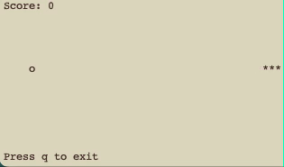

# Snake

A simple terminal based Snake game written in **modern C++** using **ncurses** library.



## Controls

| Key | Action |
|-----|--------|
| **↑ ↓ ← →** | Move snake |
| **q**       | Quit the game |

## Dependencies

This project relies only on **ncurses** for terminal rendering.

Make sure `ncurses` is installed:

### Linux

**Ubuntu/Debian**

```bash
sudo apt-get install libncurses-dev
```

**Fedora/RHEL**

```bash
sudo dnf install ncurses-devel
```

### macOS (Homebrew)

```bash
brew install ncurses
```

### Windows

Windows does not support ncurses natively. You can compile using PDCurses instead

## Building The Game

```bash
clang++ -Wall -std=c++17 -o snake snake.cpp -lncurses
```

## Running The Game

```bash
./snake
```

## Modern C++ Features Used

* std::chrono library for frame timing
* std::mt19937, std::random_device, std::uniform_int_distribution for random food placement
* Range-based for loops
* Uniform initialization { }
* RAII for managing ncurses (Render constructor/destructor)
* auto type deduction
* move semantics